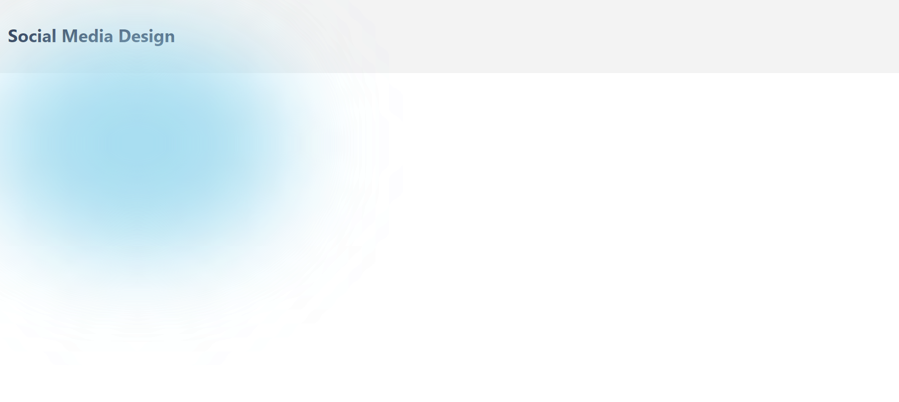
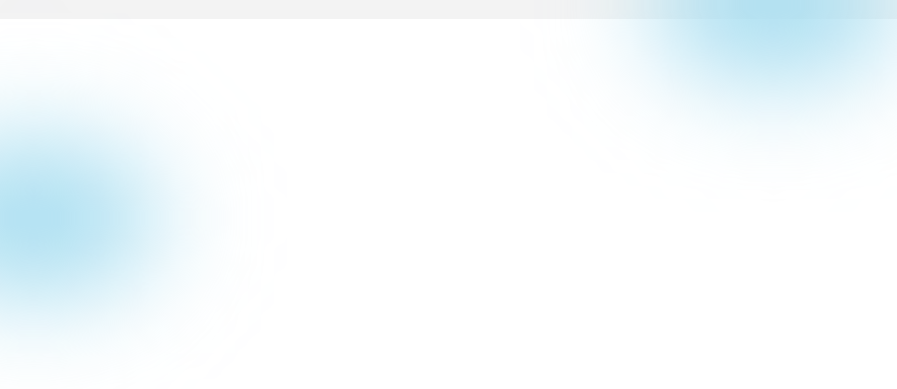

# Building beautifu UI using CSS.
Check out final project output


## Dependencies required
- React Unicon `npm install --save @iconscout/react-unicons`
- A fully Featured React Component Library for accessible web application `npm install @mantine/core @mantine/hooks`
<strong>Hooks library</strong>
Mantine comes with more than 30 hooks to manage state and UI to help you build custom components.
All hooks that are used to build Mantine components are exported from @mantine/hooks package, hooks do not depend on components packages, you can use them independently in any react application.

- Install the Popins google fonts. Copy the links `https://fonts.google.com/specimen/Poppins` and paste in your `/public/index.html`

- Add the font-family in your index.html file. Setting the margin to 0. 
    ~~~
    <style>
      body{
        font-family: 'Poppins', sans-serif;
        margin: 0;
      }
    </style>
    ~~~

### Styling the Blur background:
We add 2 divisions of class blur. `<div className="blur"></div>` in our main App div.
~~~
.blur{
  position: absolute;
  width: 22rem; /*the width & height can vary */
  height: 14rem;
  border-radius: 50%;
  background-color: #a6ddf0;
  filter: blur(72px);
}
~~~
### The final output

### We add another `<div className="blur"></div>` and apply inline styling to position the blur effect
~~~
 <div className="App">
    <div className='blur' style={{top:'-18%', right:'0'}}></div>
    <div className='blur' style={{top:'36%', left:'-8rem'}}></div>
</div>
~~~
Output

<hr />

## App Home page
The application home page is divided into 3-sections.
- The profile side
- The post side at the center
- The right side.
Create a page folder in src and add home folder
- We will add the `Home.jsx` component and `Home.css` files.
- With the three sections aforementioned, we add three different `<div></div>`'s 
~~~
<div className="home-page">
    <div className="profile-side">Profile</div>
    <div className="post-side">All Posts</div>
    <div className="right-side"></div>
</div>
~~~

- Import your home component to the App.js (Parent component).
### App Home Component Structure
#### 1. Post Section
```
├───components
│   ├───PostSection
│   │   ├───Post
│   │   ├───PostShare
│   │   └───UsersPosts
│   ├───profile
│   │   ├───FollowersCard
│   │   ├───LogoSearch
│   │   └───ProfileCard
│   └───RightSidebar
│       ├───Topnav
│       └───Trendings
├───data
├───img
└───pages
    └───home


```
